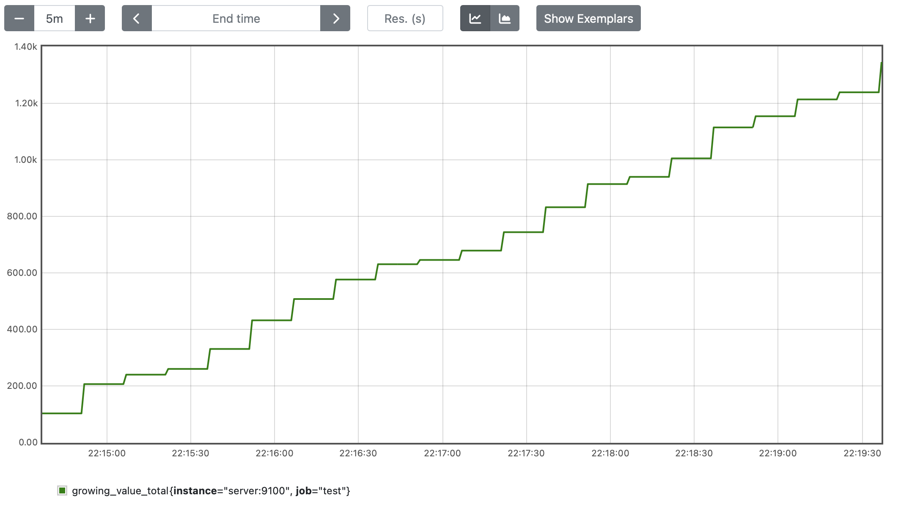
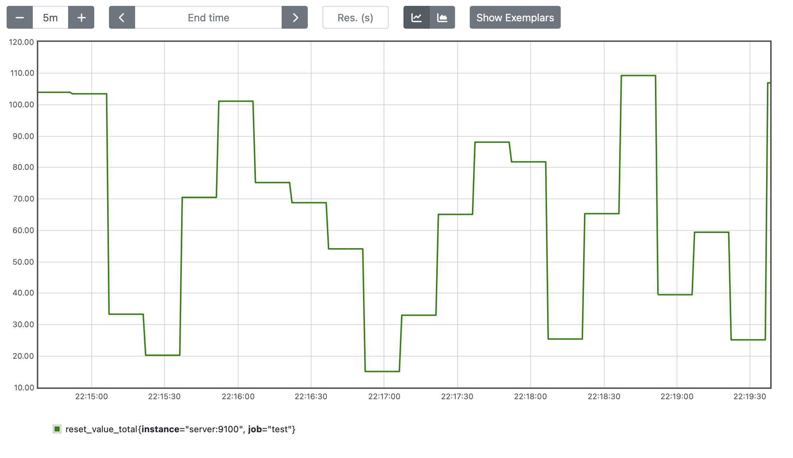
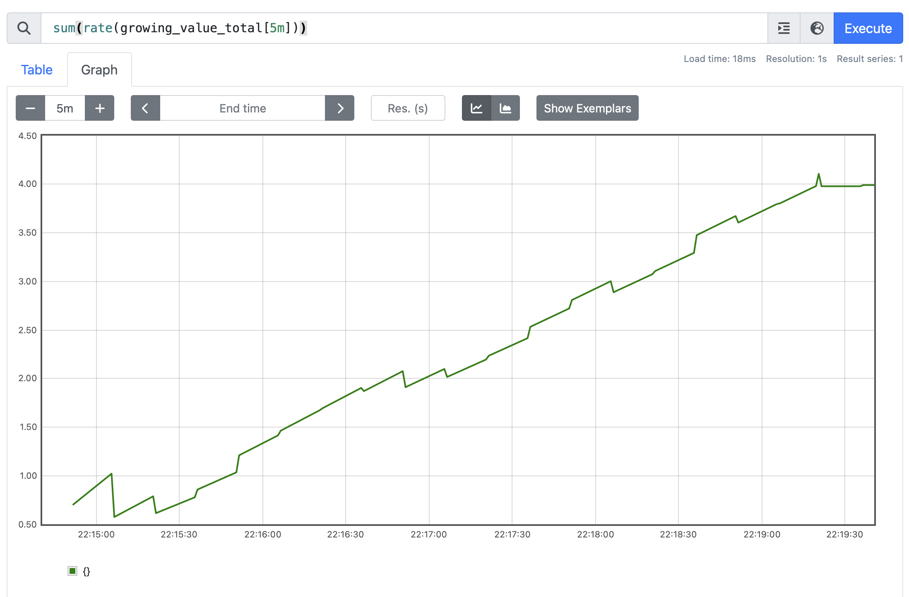
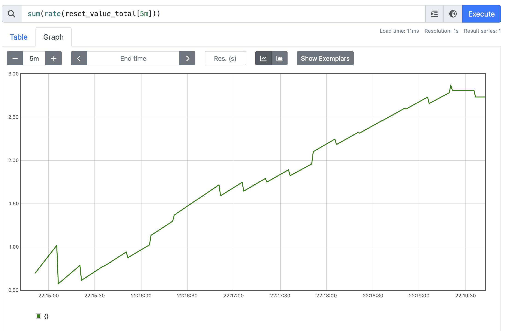

# Setup

A server generating 2 counters for the same stats, but one is never reset to zero and one is always reset to 0.

# Counter that always grow, never reset

See the ever increasing value.

# Counter that reset after each scraping

Random at every step.

# The sum(rate()) of the counter that always grow

# The sum(rate()) of the counter that always reset

**Both sum(rate()) look the same!**
